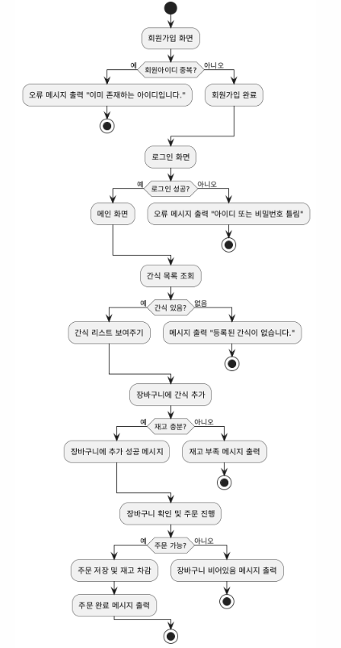
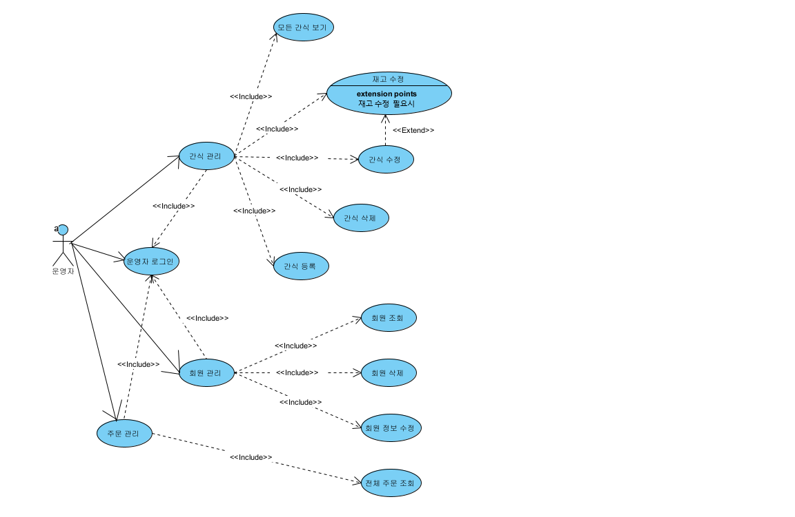
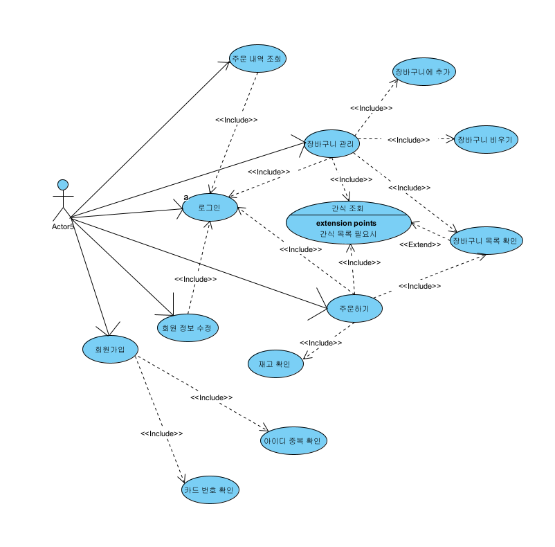
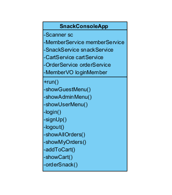
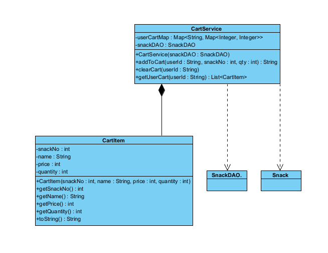
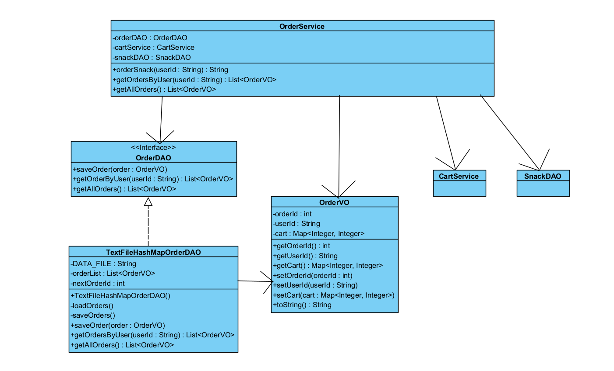
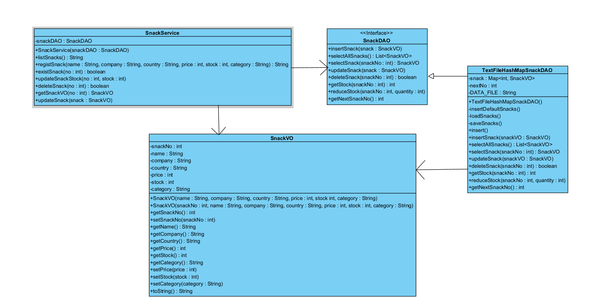
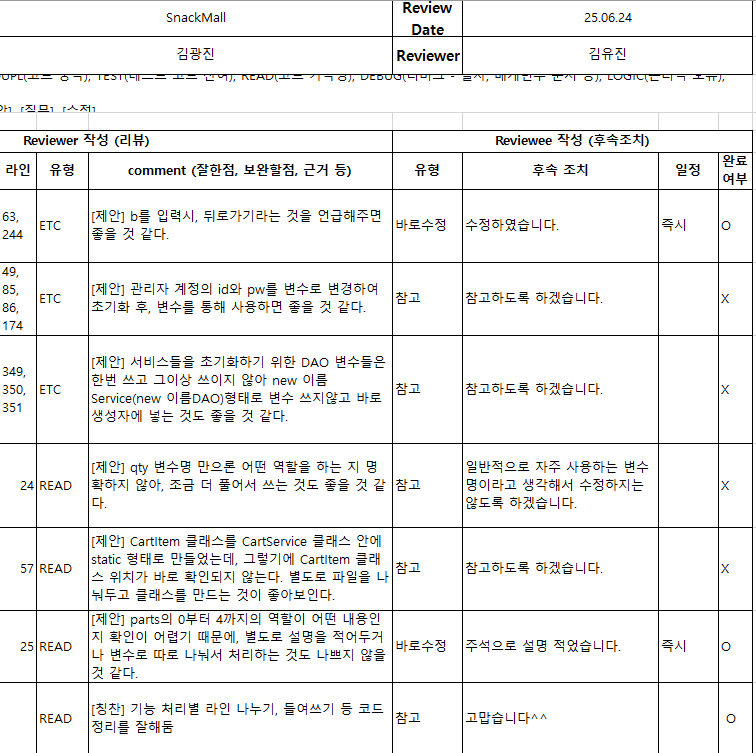
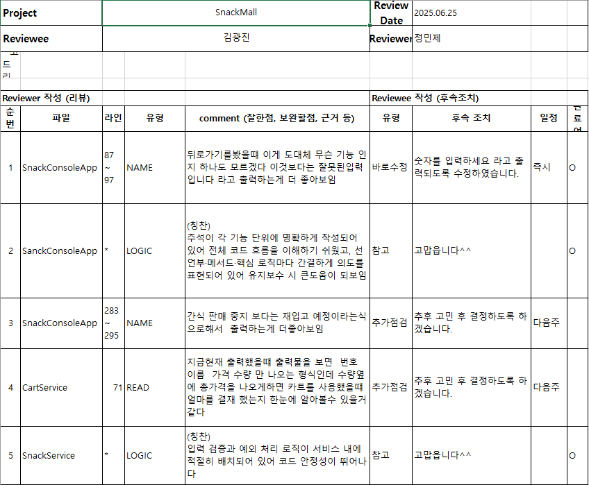
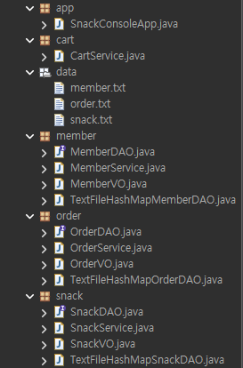

# 간식 쇼핑몰 콘솔 앱

## 목차
1. [프로젝트 개요](#프로젝트-개요)  
2. [프로젝트 목적](#프로젝트-목적)  
3. [다이어그램](#다이어그램)  
    - [액티비티 다이어그램](#1-액티비티-다이어그램)  
    - [유스케이스 다이어그램](#2-유스케이스-다이어그램)  
    - [패키지 다이어그램](#3-패키지-다이어그램)  
4. [코드 리뷰](#4-코드-리뷰)  
5. [주요 기능](#주요-기능)  
6. [폴더 구조](#폴더-구조)  
7. [시연 영상](#시연-영상)  

---

## 프로젝트 개요

간식 쇼핑몰 콘솔 앱은 회원 관리, 간식 관리,  
장바구니, 주문 기능을 포함하는  
Java 기반 콘솔 애플리케이션

---

## 프로젝트 목적

콘솔 기반의 간단한 간식 쇼핑몰 시스템을 구현함으로써  
파일 입출력, 객체지향 프로그래밍,  
컬렉션 프레임 워크, 인터페이스 기반 설계,  
계층 구조 설계에 익숙해지는 것이 목적

---

## 다이어그램

### 1. 액티비티 다이어그램

### 2. 유스케이스 다이어그램

운영자  

회원  

### 3. 패키지 다이어그램

앱 패키지  

카트 패키지  

오더 패키지  

멤버 패키지  

스낵 패키지  

---

## 4. 코드 리뷰

코드 리뷰 1  

코드 리뷰 2  

---

## 주요 기능

- 회원가입 / 로그인 / 로그아웃  
- 관리자: 간식 등록, 수정, 삭제, 재고 관리  
- 사용자: 간식 목록 조회, 장바구니 추가/조회, 주문 처리 및 주문 내역 조회  
- 주문 내역은 사용자별로 관리되며, 관리자는 전체 주문 내역 조회 가능

---

## 폴더 구조

---

## 시연 영상

### 운영자 시연 영상

### 회원 시연 영상

