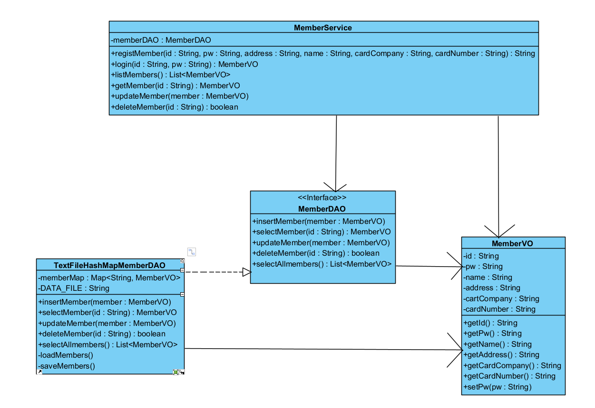
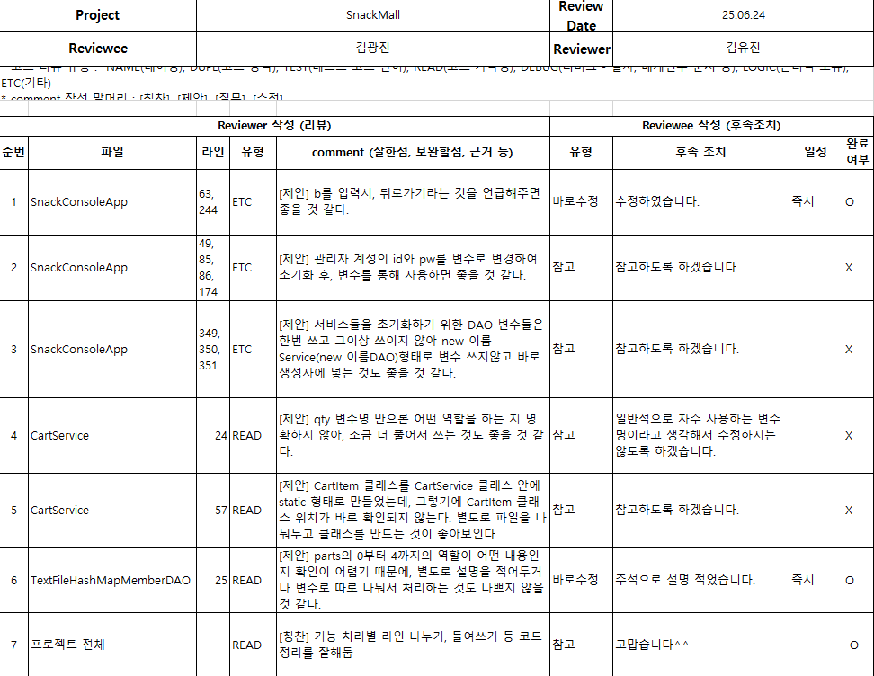

# 간식 쇼핑몰 콘솔 앱

## 목차
1. [프로젝트 개요](#프로젝트-개요)  
2. [프로젝트 목적](#프로젝트-목적)  
3. [다이어그램](#다이어그램)  
    - [액티비티 다이어그램](#1-액티비티-다이어그램)  
    - [유스케이스 다이어그램](#2-유스케이스-다이어그램)  
    - [패키지 다이어그램](#3-패키지-다이어그램)  
4. [코드 리뷰](#4-코드-리뷰)  
5. [주요 기능](#주요-기능)  
6. [폴더 구조](#폴더-구조)  
7. [시연 영상](#시연-영상)  
8. [후기](#후기)
---

## 프로젝트 개요

간식 쇼핑몰 콘솔 앱은 회원 관리, 간식 관리,  
장바구니, 주문 기능을 포함하는  
Java 기반 콘솔 애플리케이션

---

## 프로젝트 목적

콘솔 기반의 간단한 간식 쇼핑몰 시스템을 구현함으로써  
파일 입출력, 객체지향 프로그래밍,  
컬렉션 프레임 워크, 인터페이스 기반 설계,  
계층 구조 설계에 익숙해지는 것이 목적

---

## 다이어그램

### 1. 액티비티 다이어그램

### 2. 유스케이스 다이어그램

운영자  

회원  

### 3. 패키지 다이어그램

앱 패키지  

카트 패키지  

오더 패키지  

멤버 패키지  

스낵 패키지  

---

## 4. 코드 리뷰

코드 리뷰 1  

코드 리뷰 2  

---

## 주요 기능

- 회원가입 / 로그인 / 로그아웃  
- 관리자: 간식 등록, 수정, 삭제, 재고 관리  
- 사용자: 간식 목록 조회, 장바구니 추가/조회, 주문 처리 및 주문 내역 조회  
- 주문 내역은 사용자별로 관리되며, 관리자는 전체 주문 내역 조회 가능

---

## 폴더 구조

---

## 시연 영상

### 운영자 시연 영상

### 회원 시연 영상

---

## 후기

이번 프로젝트는 Java 콘솔 애플리케이션으로 간단한 쇼핑몰 시스템을 직접 만들어 보면서, 각 기능을 역할별로 나누고 책임을 분리하는 객체지향 설계와 계층 구조를 실제로 경험할 수 있어 좋은 학습이 되었습니다. 특히 회원 관리, 간식 등록, 장바구니, 주문 기능을 하나씩 구현하며, 콘솔 입출력 처리와 파일 입출력을 통해 데이터가 프로그램 종료 후에도 유지되는 방식을 익힌 점이 의미 있었습니다. 또한 서비스와 DAO 계층을 분리해 개발하면서, 각자의 역할이 명확해지고 코드가 더 깔끔해지는 효과를 느꼈습니다.

하지만 요구사항 명세서대로 계획을 세워 진행하지 않고, 그때그때 필요한 기능을 추가하다 보니 전체 구조가 복잡해지고 예상치 못한 문제도 자주 발생했습니다. 기능을 더할 때마다 기존 코드와 충돌하거나 수정해야 할 부분이 많아졌고, 프로그램의 흐름을 파악하는 데에 더 많은 시간이 걸렸습니다. 이 경험을 통해 앞으로는 처음부터 전체 흐름을 충분히 고려한 설계와 계획을 세우는 것이 매우 중요하다는 점을 깨달았습니다.
